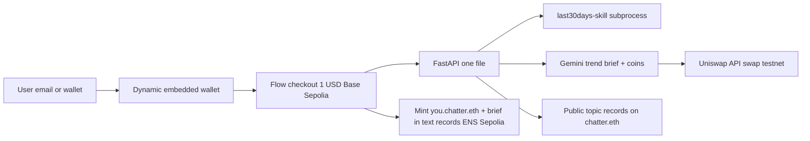

# ETHGlobal New York 2026 — Hackathon Plan (rev 5, locked)

> Execution detail lives in [PRD.md](PRD.md) — task breakdown with files, acceptance criteria, dependencies, and model-tier assignments for delegated builds.

**Rev 5 updates (from on-site meetings with Uniswap):**
- Install Uniswap AI skills (`npx skills add Uniswap/uniswap-ai`) before building — the `swap-integration` skill documents the exact Trading API flow (check_approval, quote, execute) and guides any coding agent.
- **Tokenized assets** (launched June 12, live via the same Uniswap API): trends map to ANY tradable asset — crypto coins or tokenized equities (Tesla, NVIDIA, SpaceX). Display + quote equities; execute demo swaps on regular tokens only (security pools may be compliance-gated by v4 hooks).
- Maintain `docs/UNISWAP_FEEDBACK.md` during the build — Uniswap team asked for a feedback file tracking API errors/bugs/DX friction.
- API key rate limit is 6 RPS — all Uniswap responses cached server-side.

**Track:** Extend Open Source (Continuity)  
**Window:** Fri evening → Sun 9:00am EDT = 16h build + 2h video/docs  
**Partner prize selections (cap of 3):** Dynamic, Uniswap, ENS  
**Status:** Shipped — live at [chatterethglobal.vercel.app](https://chatterethglobal.vercel.app). See [README](../README.md#hackathon-status).

## User flow (the demo is the product)

1. **Land** on Chatter; sign in with email/social or wallet — Dynamic creates an embedded wallet silently for users who don't have one
2. **Pay $1** to unlock a research run — Fireblocks Flow checkout on Base Sepolia (pay in any supported token, Chatter settles in USDC)
3. **Research** — enter 5-20 keywords; trend dashboard shows topics, aggregate strength across scraped mediums, Gemini trend briefs, and associated coins. Each coin card pairs **social mindshare** (chatter score) with **on-chain momentum** (Uniswap 24h pool volume/price delta) — "trending" means both signals agree
4. **Own it** — payment mints `you.chatter.eth` (Sepolia subname); your trend brief is written to your name's text records; public topic indexes published on `chatter.eth`
5. **Act** — swap into a trending coin via the Uniswap API (testnet execution, txids recorded)

**ENS value prop:** *Chatter has no user database — ENS is the account system and the receipt ledger. Your research belongs to your name, not our backend.* Proof in demo: resolve the user's subname in the official ENS app.

## Prize tracks reachable

| Partner | Tracks | Key requirements |
|---------|--------|------------------|
| Dynamic | Flow ($3k), Best Overall ($2k), Wallet Glow Up ($2k, Continuity-only) | Deployed app usable by judges; Flow auto-enabled via ETHGlobal NYC form in dashboard |
| Uniswap | Best API Integration ($7k) | Real on-chain txids (testnet OK), public repo, demo video ≤3 min, developer feedback form |
| ENS | Integrate ENS pool ($6k split), Continuity ($4k), Most Creative ($5k) | Real ENS code, functional demo, no hard-coded values, booth presentation Sunday morning |

## Architecture

Chains: Base Sepolia (Flow paywall, swap), Ethereum Sepolia (ENS subnames via NameWrapper, app server-signer owns parent name).

## Build plan (16h)

| Phase | Time | Work |
|-------|------|------|
| 0 | 2h | `core/research.py` (Qt-free runner), one-file FastAPI, pre-cached demo results |
| 1 | 2h | Next.js: landing, keyword input, trend dashboard shell |
| 2 | 1.5h | Dynamic login + embedded wallets; PyQt before/after assets |
| 3 | 2h | Flow $1 checkout (JS SDK, Base Sepolia); research gated on settlement |
| 4 | 1.5h | Gemini briefs + associated-coin extraction |
| 5 | 2.5h | ENS subname mint on payment, brief in text records, public topic records |
| 6 | 2.5h | Uniswap: on-chain momentum data (24h volume + price delta per coin) + swap quote/execute (testnet), record txids |
| 7 | 1.5h | Cloud Run deploy |
| — | 0.5h | Buffer |

**Cut order if behind:** public topic records → on-chain momentum cards (swap txids alone still qualify) → Flow downgrades to plain USDC transfer → drop Uniswap (txids mandatory, quote-only earns nothing; submit 2 partners) → simplify visualizations.

**Final 2h:** ~3 min demo video (email login → $1 payment → dashboard → subname in official ENS app → swap txid), submission form, Uniswap feedback form.

## Compliance

- Granular commits throughout (single-dump histories risk disqualification)
- AI attribution: Cursor used; plan docs stay in repo as directed-AI artifacts
- README separates pre-existing work from hackathon work (Continuity rule)
- ENS booth presentation Sunday morning
- Demo video 2-4 min (≤3 for Uniswap)

## Pre-build checklist (tonight)

- Dynamic env ID + ETHGlobal NYC Flow enablement form (Dashboard > Account > Settings)
- Uniswap Developer Platform API key; locate feedback form
- Gemini API key (AI Studio)
- Alchemy RPC keys (Ethereum Sepolia + Base Sepolia)
- Faucet ETH on both testnets; register chatter parent ENS name on Sepolia (wrapped)
- Test 3-5 demo keywords through the skill; pick ones with rich chatter
