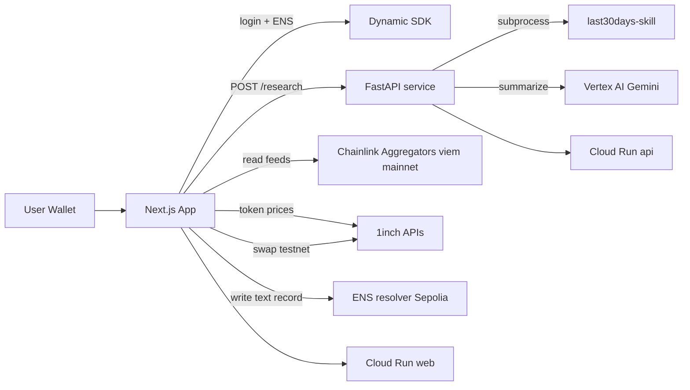

# ETHGlobal New York 2026 — Hackathon Plan

**Track:** Extend Open Source (build on existing Chatter codebase)  
**Timeline:** ~30 hours (2.5 days × 12h)  
**Status:** Planned — not started. See [README](../README.md#current-status).

## Goal

Turn Chatter into a wallet connected crypto mindshare / trend intelligence web app:

Connect wallet (Dynamic) or sign in with .eth profile → enter keywords → Chatter pulls cross-platform mindshare → Gemini (Google Cloud) summarizes into a trend brief across socials + extracts token tickers → show live on-chain prices (Chainlink feeds + 1inch Price API) → allow users to act: swap into the trend (1inch) → publish: save the brief to your .eth profile (ENS text record).

## Target prizes (~$65k surface)

| Sponsor | Prize | Integration |
|---------|-------|-------------|
| ENS | $20k | Sign-in identity, publish trend brief to `.eth` text record |
| Google Cloud | $20k | Vertex AI Gemini summarization + Cloud Run deploy |
| Dynamic | $10k | Wallet + social login |
| Chainlink | $10k | Read Data Feed aggregators on mainnet via viem |
| 1inch | $5k | Spot Price API + Swap API |

## Architecture

**Networks:** mainnet read-only (Chainlink feeds, 1inch prices) + Sepolia for writes (ENS text records, demo swaps).

## Planned repo layout (hackathon additions)

| Path | Purpose |
|------|---------|
| `api/` | FastAPI: `POST /research`, `POST /summarize` |
| `web/` | Next.js (App Router, TS, Tailwind, wagmi/viem, Dynamic SDK) |
| `core/research.py` | Qt-free research runner extracted from `core/research_worker.py` |

## Phase plan

### Phase 0 — Scaffold + thin API (~4h)
- Extract subprocess logic from `core/research_worker.py` into `core/research.py`
- FastAPI `POST /research` with parallel skill runs
- Next.js scaffold with keyword input + results calling API

### Phase 1 — Auth + ENS (~5h)
- Dynamic SDK login
- Resolve primary ENS name + avatar
- Write/read trend brief to ENS text record on Sepolia

### Phase 2 — Research + AI summary (~6h)
- Wire frontend to `/research`
- Vertex AI Gemini: trend brief + token ticker extraction

### Phase 3 — On-chain token data (~5h)
- Chainlink Data Feed reads via viem (mainnet)
- 1inch Spot Price API fallback
- "Chatter Index" cards: mindshare + on-chain price

### Phase 4 — Act on the trend (~4h)
- 1inch Swap API quote + execute on Sepolia

### Phase 5 — Deploy + demo (~6h)
- Dockerize + deploy to Google Cloud Run
- Prize qualification checklist, demo script, screenshots

## Per-prize qualification checklist

- **Dynamic:** login via Dynamic SDK in demo
- **ENS:** resolve name/avatar + write/read text record
- **Google Cloud:** Vertex AI Gemini + Cloud Run deploy
- **Chainlink:** read price feed aggregator(s) on-chain via viem
- **1inch:** Spot Price API + Swap API execution

## Cuts if time runs short

1. **Keep:** Dynamic login, research + Gemini, Chainlink feed read
2. **Trim first:** ENS text-record write → ENS read-only identity
3. **Trim:** 1inch swap execution → quote-only
4. **Fallback:** demo locally if Cloud Run blocks; still call Vertex AI
