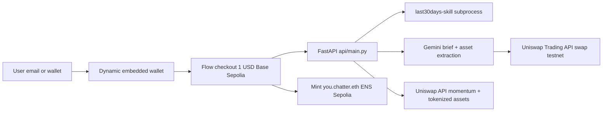
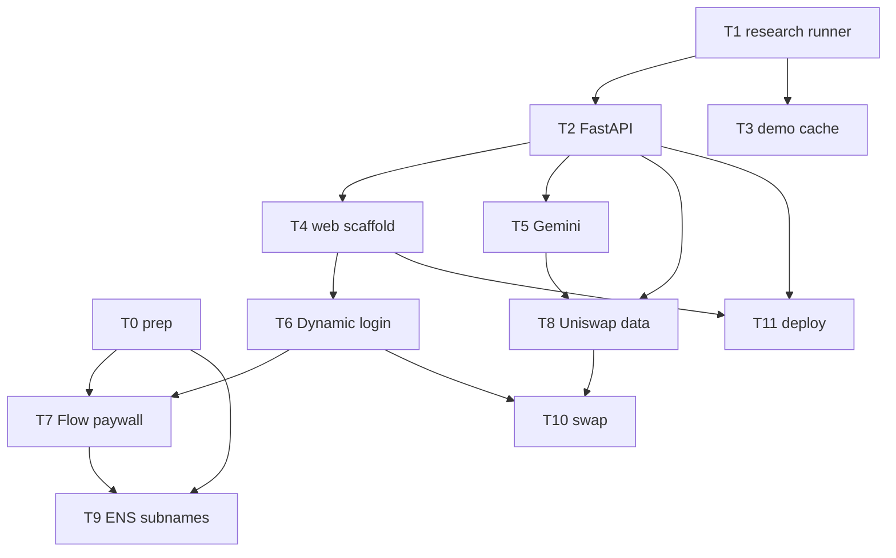

# Chatter PRD — ETHGlobal New York 2026

Product requirements + task breakdown for delegated execution. Each task lists scope, files, acceptance criteria, dependencies, and a suggested model tier so tasks can be assigned to lower-cost models where safe.

**Companion docs:** [HACKATHON_PLAN.md](HACKATHON_PLAN.md) (strategy, prizes, hour budget) | [UNISWAP_FEEDBACK.md](UNISWAP_FEEDBACK.md) (created during build; log API bugs/DX friction as encountered — requested by Uniswap team on site)

## 1. Product summary

Chatter is a GTM mindshare tool (existing PyQt desktop app wrapping `last30days-skill`). During the hackathon it becomes a monetized web app:

**Pay → Research → Act.** Sign in with email/social or wallet (Dynamic embedded wallets — no-wallet users fully served) → pay $1 (Fireblocks Flow checkout, Base Sepolia) → enter 5-20 keywords → trend dashboard (social mindshare + Gemini briefs) → asset cards pairing social score with on-chain momentum (Uniswap data) → swap into trending assets (Uniswap Trading API, testnet) → research owned by your ENS name (`you.chatter.eth` subname with brief in text records).

**Tokenized assets angle (new, launched June 12):** trending keywords are often companies, not coins. Tokenized equities (Tesla, NVIDIA, Apple, SpaceX) are live through the same Uniswap API. Chatter maps trends to ANY tradable asset — crypto coin or tokenized stock. Display + quote tokenized equities; execute demo swaps on regular tokens only (security pools may be KYC/geo-gated by v4 compliance hooks).

**Partner prize selections (cap 3):** Dynamic, Uniswap, ENS.

## 2. Architecture

- Chains: Base Sepolia (Flow paywall, demo swap), Ethereum Sepolia (ENS subnames), mainnet read-only (Uniswap market data).
- Uniswap API key rate limit is 6 RPS — cache every Uniswap response server-side.
- Judge-readability rules: one file per sponsor integration named after it; `api/main.py` stays one file; each integration file opens with a 3-4 line what/which-prize/why comment.

## 3. Global conventions (all tasks)

- Commit after every working unit (granular history is an ETHGlobal requirement).
- No new abstractions; smallest code that passes acceptance criteria.
- Secrets via `.env` / env vars only; never committed. Maintain `.env.example`.
- Log any Uniswap API error, unclear doc, or DX friction to `docs/UNISWAP_FEEDBACK.md` immediately (date, endpoint, expected vs actual).
- TypeScript on web, Python 3.12 on api. No test suites (hackathon); manual acceptance checks below.

## 4. Task breakdown

Model tiers: **CHEAP** = fast/low-cost model, boilerplate-safe. **MID** = mid-tier model, documented-API integration. **FRONTIER** = strongest model, on-chain/payment logic and debugging.

### T0 — Human prep (no model)
Dynamic env ID + ETHGlobal NYC Flow enablement form; Uniswap API key (done — 6 RPS); `npx skills add Uniswap/uniswap-ai` in repo root (installs swap-integration/viem-integration skills all agents can read); **add Dynamic docs MCP to Cursor** (`https://www.dynamic.xyz/docs/mcp` — gives all models live Dynamic docs for T6/T7); Gemini API key; Alchemy RPC keys (Ethereum Sepolia + Base Sepolia); faucet ETH both testnets; register + wrap parent ENS name on Sepolia; pick 3-5 demo keywords (mix crypto + company topics, e.g. "restaking", "Nvidia AI chips").

Optional bench (only if T9 UI drags): `npx skills add thenamespace/skills -s ens-components` — React forms for ENS records/subnames; skip the Namespace offchain-subname SDK (our prize story is on-chain Sepolia subnames verifiable in the official ENS app).

Design reference for all frontend tasks: [USER_FLOW.md](USER_FLOW.md) (screens S0-S7, states, demo beats).

### T1 — Qt-free research runner — MID
- **Files:** `core/research.py` (new). Reference `core/research_worker.py` (subprocess block) and `core/skill_manager.py` (reuse `ensure_skill_repo`, `resolve_python`, `last30days_script`).
- **Scope:** `run_research(keyword: str, save_dir: Path | None = None, timeout: int = 300) -> dict` returning `{keyword, ok, markdown, stderr, exit_code}`. No PyQt imports.
- **Accept:** `python -c "from core.research import run_research; print(run_research('solana')['ok'])"` prints True. `grep -i pyqt core/research.py` empty.
- **Deps:** none.

### T2 — FastAPI service — MID
- **Files:** `api/main.py` (single file, target ~150 lines), `api/requirements.txt`.
- **Scope:** FastAPI + CORS. `POST /research` (keywords list, ThreadPool max 6, calls T1; `?cached=1` serves `api/demo_cache/`), `POST /summarize` (calls T5 module), `GET /assets?tickers=` (calls T8 module). Endpoints stubbed with 501 until T5/T8 land.
- **Accept:** `uvicorn api.main:app` serves; `POST /research {"keywords":["solana"],"cached":true}` returns cached JSON in <1s.
- **Deps:** T1.

### T3 — Demo cache builder — CHEAP
- **Files:** `scripts/build_demo_cache.py`, output `api/demo_cache/<slug>.json`.
- **Scope:** run T1 over the demo keywords, save raw markdown + metadata JSON. Re-runnable.
- **Accept:** files exist for all demo keywords; valid JSON; API `cached=1` path reads them.
- **Deps:** T1. Run before judging; never run skill live in demos.

### T4 — Next.js scaffold + landing + dashboard shell — CHEAP
- **Files:** `web/` via create-next-app (App Router, TS, Tailwind); `app/page.tsx` (landing: one-line pitch, Start button), `app/research/page.tsx` (keyword textarea 5-20, results grid), `components/TopicCard.tsx`, `components/AssetCard.tsx` (props-driven, mock data ok), `lib/api.ts` (typed fetch to FastAPI base URL env var).
- **Accept:** `npm run dev` renders landing + research page; submitting keywords hits `POST /research` and renders markdown results; loading/error states present. No wallet code in this task.
- **Deps:** T2 (API shape). Parallelizable with T1-T3.

### T5 — Gemini trend brief + asset extraction — MID
- **Files:** `api/gemini.py` (header comment: product feature, no prize claim).
- **Scope:** input raw chatter markdown → strict JSON via one prompt: `{themes[], sentiment, momentum_score 0-100, assets[{ticker, name, kind: "crypto"|"equity", confidence}]}`. `kind` distinguishes coins from companies with tokenized equities. Retry-once on invalid JSON; cache outputs beside demo cache.
- **Accept:** demo-cache inputs produce valid JSON; "Nvidia AI chips" input yields an `equity` asset; wire `POST /summarize`.
- **Deps:** T2.

### T6 — Dynamic login + embedded wallets — MID
- **Files:** `web/components/DynamicLogin.tsx`, provider wiring in `web/app/layout.tsx` (header comment: Dynamic prize, Wallet Glow Up + Best Overall).
- **Scope:** DynamicContextProvider (env ID from env var), email/social + wallet login, embedded wallet auto-created for walletless users; header shows account; gate `/research` behind login.
- **Accept:** email login creates usable embedded wallet (address visible); external wallet connect works; logged-out users redirected from `/research`.
- **Deps:** T4. Also: screenshot PyQt app for before/after glow-up assets (human, 5 min).

### T7 — Flow $1 paywall — FRONTIER
- **Files:** `web/lib/flow.ts`, `web/components/Paywall.tsx` (header comment: Dynamic Flow prize).
- **Scope:** Flow JS SDK `checkout` namespace on Base Sepolia: create checkout (server or dashboard-config), then `createCheckoutTransaction → attachCheckoutTransactionSource → getCheckoutTransactionQuote → submitCheckoutTransaction → poll getCheckoutTransaction`. On settled: store unlock client-side and notify API; research gated on unlock. Payment success event triggers T9 subname mint.
- **Accept:** testnet payment from embedded wallet completes; research unlocks only after settlement; failure path shows retry.
- **Fallback (time-boxed 2h):** plain USDC transfer on Base Sepolia to treasury address; keep same `Paywall` interface so nothing downstream changes.
- **Deps:** T6. Flow must be enabled via dashboard form (T0).

### T8 — Uniswap market data + tokenized assets — MID (uniswap-ai skill installed)
- **Files:** `api/uniswap_data.py` or `web/lib/uniswap.ts` (pick API-side for caching; header comment: Uniswap prize, market data half).
- **Scope:** (1) ticker→address via Uniswap default token list (cache at startup; unmatched tickers labeled `unverified`, never guessed — scam filter). (2) 24h volume + price delta per asset (Uniswap API data endpoints; subgraph fallback). (3) Tokenized equity discovery for `kind=equity` assets via API search/explore; badge `Tokenized equity`. (4) Momentum score 0-100; server cache ≥60s TTL (6 RPS limit). Wire `GET /assets`.
- **Accept:** ETH/UNI return volume + delta; NVDA/TSLA resolve to tokenized equity with badge; junk ticker → `unverified`; repeated calls hit cache.
- **Deps:** T2, T5 (asset list shape). AssetCard (T4) renders: social score | on-chain momentum | agreement label (high/high = Confirmed trend; high/low = Narrative only; low/high = Quiet accumulation).

### T9 — ENS subnames + text records — FRONTIER
- **Files:** `api/ens.py` (server-side signer owns parent name) + `web/components/EnsReceipt.tsx` (header comment: ENS prize, account/receipt layer).
- **Scope:** on payment: NameWrapper `setSubnodeRecord` mints `<handle>.chatter.eth` (Sepolia) owned by user's wallet; `setText` writes `com.chatter.brief` (brief JSON/URI) + ENSIP-style metadata records. UI resolves and displays records live (ENS rule: functional, no hard-coded values). Public topic records on parent name only if ahead of schedule.
- **Accept:** fresh payment → new subname visible in official Sepolia ENS app with records; `EnsReceipt` renders from live resolution; second user gets distinct subname.
- **Deps:** T7 (trigger), T0 (wrapped parent name + funded signer).

### T10 — Uniswap swap execution — FRONTIER (uniswap-ai skill installed)
- **Files:** `web/lib/uniswapSwap.ts`, `web/components/SwapButton.tsx` (header comment: Uniswap prize, execution half).
- **Scope:** Trading API flow per swap-integration skill: `POST /check_approval → POST /quote → execute` signed by connected/embedded wallet on testnet. Regular tokens only (tokenized equities: quote shown, execution disabled with compliance note). Persist txids to `docs/SUBMISSION_TXIDS.md`.
- **Accept:** at least one successful testnet swap end-to-end from the UI; txid recorded and explorer-verifiable; quote-only path renders for equities.
- **Deps:** T6, T8. Log every API issue to UNISWAP_FEEDBACK.md.

### T11 — Deploy — MID
- **Files:** `api/Dockerfile` (skill repo pre-cloned in image), `web/Dockerfile` (or Vercel for web), deploy notes in README.
- **Scope:** both services live on Cloud Run; env vars set; CORS locked to web origin. Dynamic requires a deployed app judges can use.
- **Accept:** public URL completes login → cached research → dashboard.
- **Deps:** T2, T4 minimum; redeploy after later tasks.

### T12 — Docs + compliance — CHEAP draft, human review
- **Files:** `EXPLAINER.md` (one plain-English paragraph per integration — doubles as pitch script), README "built during hackathon" status update, AI-attribution section (Cursor used; plan/PRD docs are the directed-AI artifacts), `docs/UNISWAP_FEEDBACK.md` finalized.
- **Accept:** a judge can map every sponsor to its file and its paragraph in under a minute.
- **Deps:** all integration tasks (drafts can start anytime).

### T13 — Demo video + submission — Human (CHEAP for script draft)
- ~3 min (Uniswap cap): email login → $1 Flow payment → dashboard (social + on-chain signals, tokenized equity badge) → subname resolving in official ENS app → swap with txid.
- Submission form: select Dynamic, Uniswap, ENS; per-partner writeups from EXPLAINER. ENS booth Sunday morning.

## 5. Dependency graph

Parallel lanes: (T1→T2→T3) and T4 can run simultaneously; T5/T8 while T6/T7 are in progress.

## 6. Hour budget vs tasks

| Task | Est | Tier |
|------|-----|------|
| T1+T2 | 2h | MID |
| T3 | 0.5h | CHEAP |
| T4 | 2h | CHEAP |
| T5 | 1.5h | MID |
| T6 | 1.5h | MID |
| T7 | 2h | FRONTIER |
| T8 | 1.5h | MID |
| T9 | 2.5h | FRONTIER |
| T10 | 1.5h | FRONTIER |
| T11 | 1h | MID |
| T12 | 0.5h | CHEAP |
| Total | 16.5h | (0.5h over — absorbed by parallel lanes) |

## 7. Cut order if behind

1. Public topic records on parent ENS name (keep user subnames — the value prop).
2. Tokenized equity discovery (keep crypto momentum; lose the showcase, keep the prize).
3. On-chain momentum cards (swap txids alone still qualify for Uniswap).
4. Flow → plain USDC transfer (lose $3k Flow track; keep paywall story).
5. Uniswap entirely (txids mandatory; submit 2 partners).

## 8. Risks

- Flow checkout undocumented edge cases → fallback interface designed in (T7).
- Tokenized equity pools compliance-gated → display/quote only, by design.
- ENS NameWrapper quirks on Sepolia → FRONTIER tier + earliest possible start after T7.
- 6 RPS Uniswap limit → server-side caching mandatory (T8).
- Skill returns thin results live → demo cache (T3), never live-run in front of judges.
