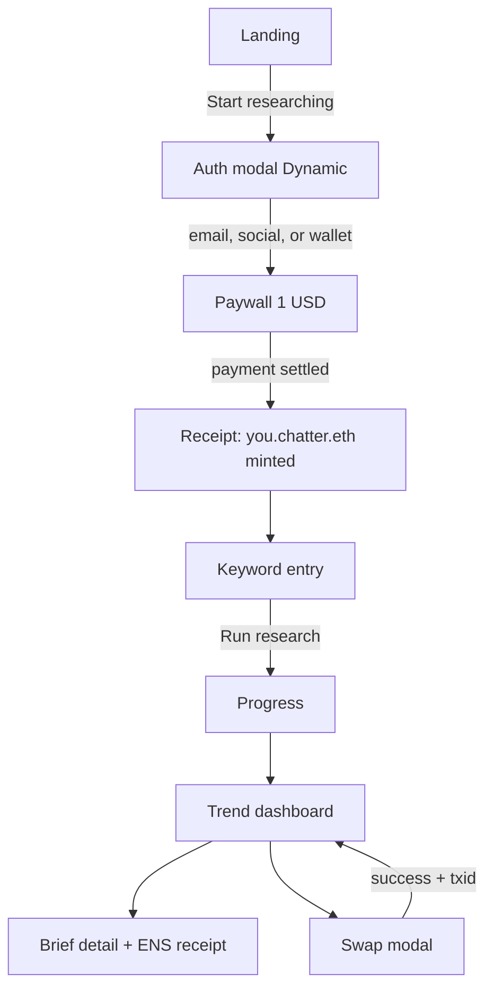

# Chatter — User Flow & Screen Outline

Design reference for frontend work (Variant/Canva). Desktop-first; the demo video follows this exact path top to bottom.

## Flow at a glance

User states to design for: logged out → logged in/unpaid → paid/no research → researching → results.

---

## S0 — Landing

Goal: explain the product in 5 seconds, push to one CTA.

- Hero: name + one-liner: "See where the chatter is. Pay $1. Act on the trend."
- Subline: "Social mindshare across Reddit, HN, GitHub, Polymarket — matched against live on-chain market data."
- Primary CTA: "Start researching — $1"
- Three-step strip: 1. Pay with any token 2. Enter your keywords 3. Get trends + tradable assets
- Sample report preview (blurred or mock TopicCard + AssetCard)
- Trust strip: built on Dynamic, Uniswap, ENS logos
- Note for no-wallet users: "No wallet? Sign in with email — we create one for you."

## S1 — Auth (Dynamic modal)

Mostly Dynamic's prebuilt widget; design the surrounding frame only.

- Options: email, social, or connect existing wallet
- Microcopy under email option: "We'll create a secure wallet for you automatically."
- Post-login header (persistent on all screens): avatar + ENS name (or truncated address), network badge, sign out

## S2 — Paywall ($1 checkout)

The Flow moment — make the "pay with anything" point visually.

- Card: "Unlock a research run — $1"
- Token selector: "Pay with..." (any supported token/chain; Flow handles conversion — show small "auto-converts to USDC" hint)
- Quote line: amount in selected token + fee
- Button states: Get quote → Confirm in wallet → Processing (poll) → Paid ✓
- Failure state: error banner + Retry (keep user on screen, don't dead-end)

## S2b — Receipt (the ENS wow moment)

Can be a success panel on S2 rather than its own screen.

- Headline: "You now own you.chatter.eth"
- Shows: minted subname, link "View in ENS app" (proof it's real/on-chain)
- Subline: "Your research reports are saved to your name — portable, permanent, yours."
- CTA: "Enter your keywords"

## S3 — Keyword entry

- Textarea or chip input: 5-20 keywords, counter (e.g. 7/20)
- Helper examples: "restaking", "Nvidia AI chips", "prediction markets" (mix crypto + company topics — shows tokenized equity support)
- Quick-fill button: "Try demo keywords" (loads cached set — used in judging)
- CTA: "Run research" + estimate note ("~1 min per topic; demo topics are instant")

## S4 — Progress

- Per-keyword row: keyword, status (Queued / Researching / Summarizing / Done), spinner
- Skeleton cards filling in as results land (results stream per-keyword, not all-at-once)

## S5 — Trend dashboard (the core screen)

Two stacked sections.

### Topics section — "What's trending"
TopicCard per keyword:
- Keyword title + overall mindshare strength meter (0-100)
- Platform breakdown chips: Reddit / HN / GitHub / Polymarket with per-source counts
- Sentiment tag (positive/neutral/negative) + momentum arrow
- 2-line Gemini brief excerpt + "Read full brief" → S6

### Assets section — "What's tradable"
AssetCard per extracted asset:
- Ticker + name + kind badge: `CRYPTO` or `TOKENIZED EQUITY` (equity badge is the Uniswap showcase — make it pop)
- Two side-by-side signal bars:
  - Social mindshare (from chatter)
  - On-chain momentum (Uniswap 24h volume + price delta, delta shown as +/-%)
- Agreement label (the headline feature):
  - both high → "Confirmed trend"
  - social high, chain flat → "Narrative only"
  - social low, chain high → "Quiet accumulation"
  - unmatched ticker → "Unverified — no on-chain match" (greyed, no swap)
- Action: "Swap" button (crypto) / "View quote" (tokenized equity — execution disabled, tooltip: "compliance-gated pool")

## S6 — Brief detail + ENS receipt

Side panel or route per topic.

- Full Gemini brief: themes, sentiment, momentum, notable sources
- ENS publish block: "Published to you.chatter.eth" + record key/value preview + "Verify in ENS app" link
- Share/copy button

## S7 — Swap modal

- From (user balance) → To (selected asset), amount input
- Quote display: rate, route ("via Uniswap"), gas estimate
- Button states: Get quote → Approve (if needed) → Swap → Pending → Success
- Success: txid + block-explorer link ("View transaction")
- Equity variant: quote shown, execute disabled with compliance note

## Error/empty states (design once, reuse)

- Payment failed (S2), thin research results ("Not much chatter — try broader keywords"), API error banner with retry, unverified asset card

## Demo video beats (maps 1:1 to screens)

1. S0 landing (5s) → 2. S1 email login, wallet auto-created (15s) → 3. S2 pay $1 in any token (25s) → 4. S2b subname minted, open ENS app (20s) → 5. S3 demo keywords → S5 dashboard tour: topic strength, equity badge, agreement labels (60s) → 6. S7 swap + txid (30s) → 7. S6 brief on ENS record (15s) → close (10s). ~3 min.
